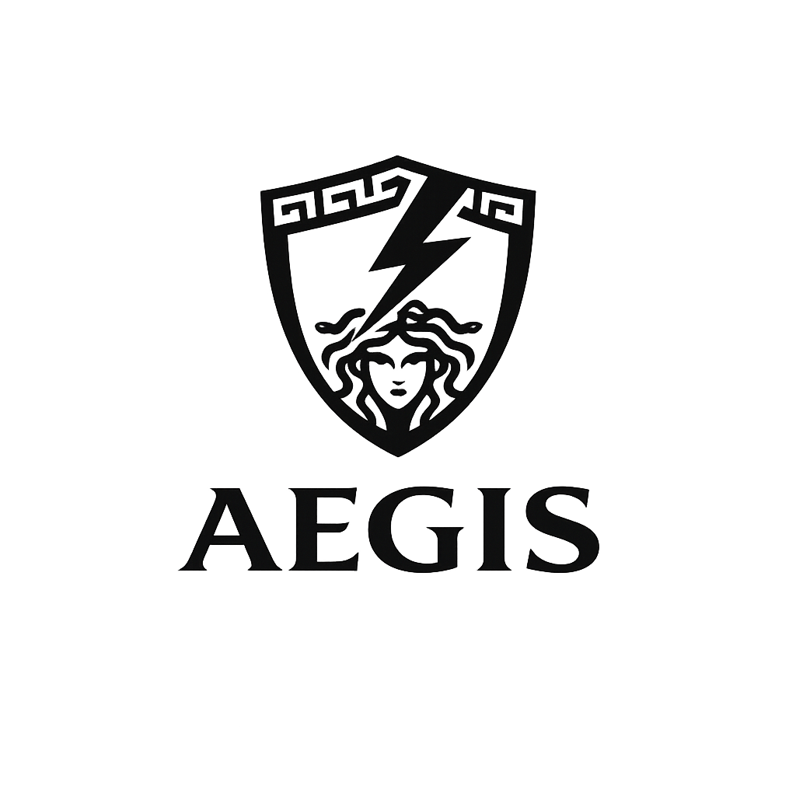

# Aegis — Agent Guardrail Runtime (Demo-Ready)

<p align="center">
  
</p>


Aegis is a Python-based agent guardrail runtime that enforces policies across **user input**, **tool calls**, **tool results**, and **model output**. It includes a web dashboard, JWT auth, database-backed event storage, and optional local LLM classification via llama.cpp.

> This repository is a **demo-ready** implementation for coursework and presentations.

---

## Features

- **Pre-LLM firewall**: prompt injection, jailbreak, goal hijack, normalization, network URL firewall
- **Post-LLM firewall**: secrets/PII redaction, exfiltration blocking, approvals
- **Tool guardrails**: allow/deny, environment restrictions, sandboxed execution
- **Fail-closed mode**: blocks on policy/classification errors when enabled
- **LLM-based classification** (local): llama.cpp sidecar + Qwen2.5-3B GGUF
- **JWT + API key auth**
- **Database persistence** (SQLite default)
- **Web dashboard** with event timeline and LLM classifications
- **Telemetry hooks** + optional OpenTelemetry

---

## Project Structure

```
Aegis/
  src/aegis/
    api/            # FastAPI endpoints (sessions, auth, dashboard)
    auth/           # API key + JWT, rate limiting
    detectors/      # regex/semantic + LLM classifiers
    runtime/        # policy engine + guarded runtime
    storage/        # DB + in-memory stores
    tools/          # client/wrappers
    telemetry/      # logging + OpenTelemetry
  config/
  scripts/
```

---

## Quickstart (Local, CPU)

```powershell
python.exe -m uvicorn aegis.api.main:app --port 8000
```

Dashboard:
```
http://127.0.0.1:8000/v1/dashboard
```

---

## Enable Local LLM Classification (llama.cpp)

1) Put llama.cpp binaries in `Aegis\llama.cpp` (already set up in this workspace).

2) Start both llama.cpp + Aegis API (dashboard included):
```powershell
.\scripts\start_demo.ps1
```

3) Manual launch option:
```powershell
.\llama.cpp\llama-server.exe \
  -m models\qwen2.5-3b-instruct-q4_k_m.gguf \
  --port 8080 --n-gpu-layers 35 --ctx-size 2048
$env:AEGIS_LLM_ENABLED="true"
$env:AEGIS_LLM_ENDPOINT="http://127.0.0.1:8080/v1/chat/completions"
$env:AEGIS_LLM_MODEL="qwen2.5-3b-instruct"
python.exe -m uvicorn aegis.api.main:app --port 8000
```

Check LLM health:
```powershell
Invoke-WebRequest -Uri "http://127.0.0.1:8000/v1/llm/ping" -Headers @{ "x-api-key"="changeme" } -UseBasicParsing
```

---

## Demo Script

```powershell
python.exe scripts\demo_cli.py
```

---

## Auth

- **API Key**: pass `x-api-key: changeme`
- **JWT**: request token and use `Authorization: Bearer <token>`

Token:
```powershell
Invoke-WebRequest -Uri "http://127.0.0.1:8000/v1/auth/token" -Headers @{ "x-api-key"="changeme" }
```

---

## Config

Edit `.env`:
```
AEGIS_API_KEY=changeme
AEGIS_FAIL_CLOSED=false
AEGIS_CORS_ORIGINS=*
AEGIS_RATE_LIMIT_BACKEND=memory
AEGIS_LLM_ENABLED=true
AEGIS_LLM_ENDPOINT=http://127.0.0.1:8080/v1/chat/completions
AEGIS_LLM_MODEL=qwen2.5-3b-instruct
AEGIS_DB_ENABLED=true
DATABASE_URL=sqlite:///aegis.db
```

Production baseline:
```powershell
Copy-Item .env.production.example .env
```
In production (`AEGIS_ENV=prod`), startup hardening rejects:
- default API key / JWT secret
- wildcard CORS (`*`)
- memory-backed rate limiting
- fail-open mode

## Guardrail Regression Tests

```powershell
python -m unittest discover -s tests -p "test_*.py" -v
```

CI enforcement is configured in:
- `.github/workflows/guardrail-regression.yml`

---

## Docker

```powershell
docker compose up --build
```

---

## Docs

- `SYSTEM_ARCHITECTURE.md` — full system walkthrough
- `CONTRIBUTING.md` — how to contribute
- `SECURITY.md` — security policy
- `AGENT_INTEGRATION_README.md` — attaching Aegis to real user agents

---

## License

MIT (for coursework / demo use)
